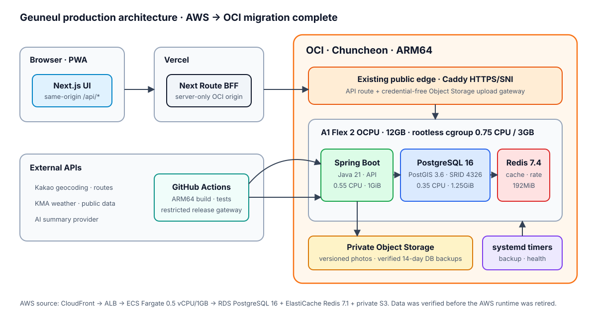
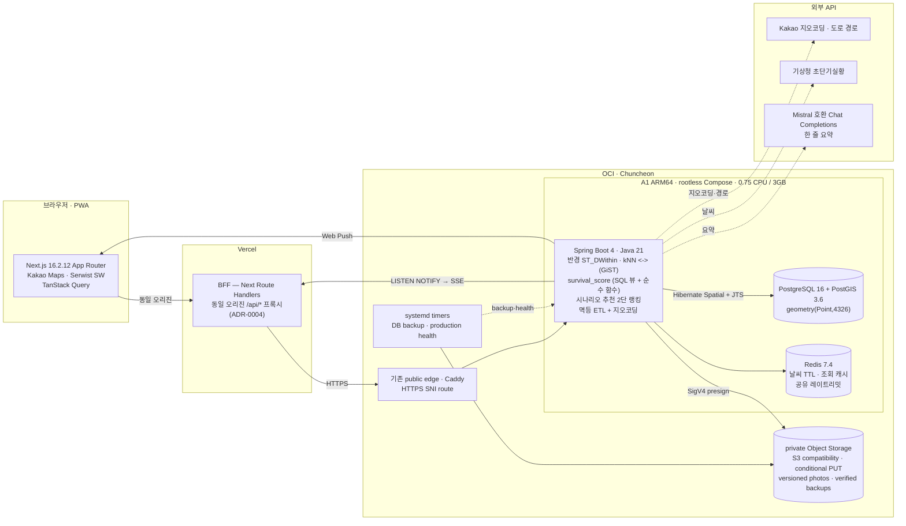
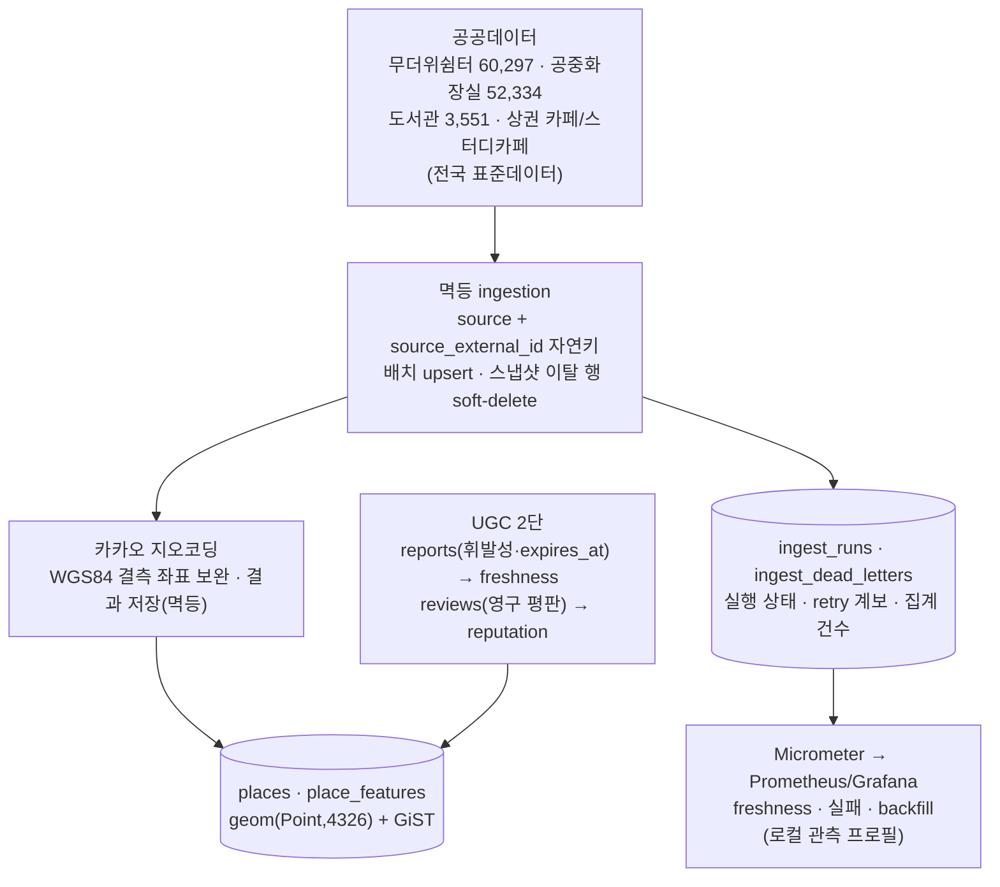
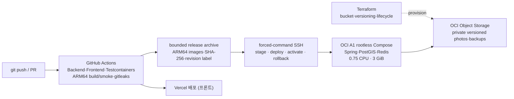

# 아키텍처 — 그늘(Geuneul)

> 런타임 데이터 흐름 + 배포 파이프라인. 핵심(PostGIS 대용량 지리검색 · 실시간 UGC 시공간 스코어링)이 어디서 돌고, 요청이 브라우저에서 DB까지 어떻게 흐르는지 한 장으로.

> 운영 상태(2026-09-03): Vercel frontend/BFF는 유지하고 AWS ECS·RDS·ElastiCache·S3 백엔드와 운영 데이터를 OCI ARM64 rootless Compose·Object Storage로 이전했다. 출발·도착 사양과 zero-loss/cutover 검증은 [ADR-0032](./adr/0032-oci-arm64-self-hosted-migration.md)와 [OCI 마이그레이션 기록](./OCI-MIGRATION.md)에 있다.
> VM 전체의 서비스 분리, 자원 상한, backup과 저장공간은 [OCI 운영 구조와 용량](./OCI-RUNTIME.md)에 정리했다.
> 결정 근거는 각 노드의 ADR 링크 참고([색인](./adr/README.md)).

## 전체 구성

## 런타임 (요청 흐름)

- **동일 오리진 BFF** — 브라우저는 항상 Vercel 위 `/api/*` 서버 프록시만 호출한다. OCI origin과 server-only 설정을 브라우저 bundle에서 숨기고 OAuth·cookie 계약을 유지한다([ADR-0004](./adr/0004-frontend-same-origin-proxy.md)). 외부 키(Kakao/KMA/AI)도 서버에만 있다.
- **공간 연산은 DB 레이어** — 반경(`ST_DWithin`)·최근접(kNN `<->`)·bounds는 GiST 인덱스로, 시공간 집계(`place_report_signals`)는 SQL 뷰로 돈다. 무거운 집계는 DB, 자주 튜닝하는 가중치 정책만 순수 Java 함수로 분리([ADR-0007](./adr/0007-survival-score-sql-signals-java-compose.md)).
- **실시간** — 제보 INSERT → Postgres `LISTEN/NOTIFY` → 멀티 인스턴스 팬아웃 → SSE 스트림 / Web Push. 과설계(Kafka) 없이 이미 있는 Postgres·Redis로([ADR-0016](./adr/0016-realtime-report-surge-listen-notify-sse.md)).
- **보안 경계** — BFF가 증명한 client identity로 Redis 레이트리밋을 공유한다. 사진은 presign 기록의
  소유자·용도와 private Object Storage object 완료 상태를 검증한 일회성 claim만 UGC가 참조하며, 만료 미사용 object는 lease 기반
  bounded job이 정리한다. JWT login/logout은 같은 user row lock으로 직렬화하고 DB `token_version`으로 즉시
  폐기할 수 있다([ADR-0031](./adr/0031-security-boundaries-session-upload-rate-limit.md)).

## 데이터 · ETL

- **멱등(idempotent)** — 같은 소스를 두 번 넣어도 중복이 안 생긴다(`source + source_external_id` 자연키 upsert). 스냅샷에서 사라진 행은 soft-delete로 비활성화한다(ADR-0002).
- **지오코딩 보완** — 공중화장실은 2025-02 이후 WGS84 좌표 미제공 → 카카오 로컬 API로 주소→좌표를 보완하고 결과를 저장(멱등·rate limit 회피).
- **운영 원장** — one-off 수집이 끝나도 V20 원장에 상태·카운터·동일 입력 digest retry 계보가 남는다. 실패 원본/주소 대신 집계형 dead letter만 저장하고, 상시 API가 이를 읽어 로컬 Prometheus/Grafana에 freshness와 backfill을 노출한다. API 전량 수집과 원격 CSV SHA-256을 DB mutation 전에 검증해 부분 snapshot의 거짓 성공을 차단한다([ADR-0030](./adr/0030-ingest-operational-ledger-deterministic-load.md)).
- **UGC 2단** — 제보(휘발성 상태, `expires_at`)는 `survival_score`의 freshness를, 후기(영구 평판)는 커뮤니티 콘텐츠를 굴린다. 시공간 랭킹은 DB(PostGIS/SQL)에서.

## 배포 (CI/CD · IaC)

- **최초 bootstrap과 일반 배포 분리** — 첫 마이그레이션에서는 ARM64 archive를 stage하고 DB/object 복원 뒤 같은 Git SHA를 activate했다. 현재 일반 release는 `deploy`가 pre-deploy off-host backup과 artifact를 검증한 뒤 활성화한다. Flyway 적용 뒤에는 이전 binary를 자동 기동하지 않는다([ADR-0032](./adr/0032-oci-arm64-self-hosted-migration.md)).
- **제한된 운영 경계** — SSH key는 shell을 열 수 없는 root-owned gateway에 묶이고, 전용 rootless user 전체에 CPU·메모리·swap 상한을 둔다. PostGIS·Redis는 외부 포트를 열지 않는다.
- **IaC** — private photos/backups bucket, 분리된 app/backup IAM, versioning과 lifecycle은 Terraform으로 관리한다. OCI에 bucket CORS API가 없어 브라우저 PUT만 자격증명 없는 Caddy gateway가 exact-origin preflight와 signed Host 전달을 담당한다.
- **CI 게이트** — 공간쿼리·인제스천은 Testcontainers 실 PostGIS로, OCI 경로는 ARM64 PostGIS 기동·backend image build·Terraform·shell/Python 보안 테스트로 검증한다. 머지 전 `gh pr checks`로 Backend/Frontend를 확인한다(TS-025).
- **무료 설치·배포** — `/install`에서 스토어 없이 $0 설치: 안드로이드 **WebAPK 원탭**(Chrome이 진짜 설치 앱 생성) + **다운로드 서명 APK**(Bubblewrap TWA, `/geuneul.apk` + `/.well-known/assetlinks.json` 도메인 검증) + iOS 홈 화면 추가. 서명 keystore는 레포 밖(로컬 비밀 저장소)에만 둔다.

---

## 데모

| 데스크톱 3분할 (지도앱 표준) | 그늘 경유 경로 + AI 요약 |
|---|---|
|  |  |

| 모바일 지도 (바텀시트 3단) | 시나리오 추천 |
|---|---|
|  |  |

> 모두 **라이브(geuneul.vercel.app) 실측 캡처**(2026-07, 필드테스트 거점 동작구 상도). 마커 상태 배지("정보 부족")는 촬영 시점 유효 제보가 없어 회색 — 제보가 쌓이면 survival_score 등급대로 초록/노랑으로 칠해진다.
